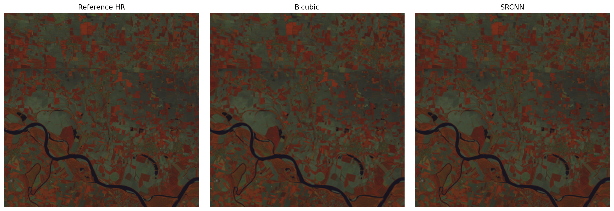

# SRCNN for Landsat Multi-Spectral Image Super-Resolution

Implementation of a Super-Resolution Convolutional Neural Network (SRCNN) adapted for multi-spectral Landsat imagery.

This project extends the original SRCNN architecture to reconstruct high-resolution multi-spectral Landsat images from synthetically degraded low-resolution inputs.
---

## Overview

The project includes:

- preparation of Landsat multi-spectral datasets
- automatic patch extraction
- global normalization
- bicubic degradation pipeline
- residual-learning SRCNN
- quantitative evaluation (PSNR, SSIM, MAE)
- visualization utilities
- experimental Bayer mosaic evaluation pipeline

---

## Dataset

The implementation has been developed using Landsat imagery.

The current pipeline supports three-band image cubes composed of:

- **B5** (Near Infrared)
- **B6** (Short Wave Infrared)
- **B4** (Red)

Images are normalized in the range **[0,1]** using a global normalization strategy before training.

---

## Project Structure

```
srcnn/
    config.py
    prepare_data.py
    generate_rgb.py
    images.py
    main.py
    psnr.py
    test_mosaic.py

tests/

data/
    raw/
    processed/

weights/

assets/
```

---

## Dataset Preparation

Generate training patches:

```bash
python -m srcnn.prepare_data
```

The preprocessing pipeline performs:

- patch extraction
- global normalization
- low-resolution image generation
- training/validation split

---

## Training

Train the SRCNN model:

```bash
python -m srcnn.main
```

The current implementation uses:

- TensorFlow / Keras
- Residual learning
- Adam optimizer
- Global normalization
- Early stopping
- Model checkpointing

---

## Evaluation

The repository provides utilities for:

- PSNR
- SSIM
- MAE
- Bicubic vs SRCNN comparison
- Batch evaluation on multiple images
- Best/Worst case analysis
- Visualization of reconstruction and error maps

---

## Example Result

Comparison between the high-resolution reference image, bicubic interpolation and the SRCNN reconstruction on one of the best-performing Landsat test patches.
<p align="center">
  
</p>

---

## Experimental Bayer Pipeline

An additional experimental pipeline is available in

```text
srcnn/test_mosaic.py
```

This module investigates Bayer-like mosaic generation from Landsat spectral bands followed by demosaicing and super-resolution.

The implementation is currently intended for research purposes.

---

## References

Dong, C., Loy, C. C., He, K., & Tang, X.

**Learning a Deep Convolutional Network for Image Super-Resolution**

https://arxiv.org/abs/1501.00092

## Installation

Clone the repository and install the required packages:

```bash
git clone https://github.com/<username>/SRCNN-keras.git
cd SRCNN-keras
pip install -r requirements.txt